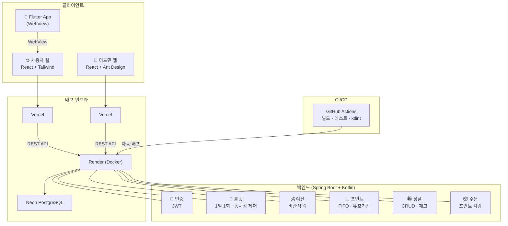
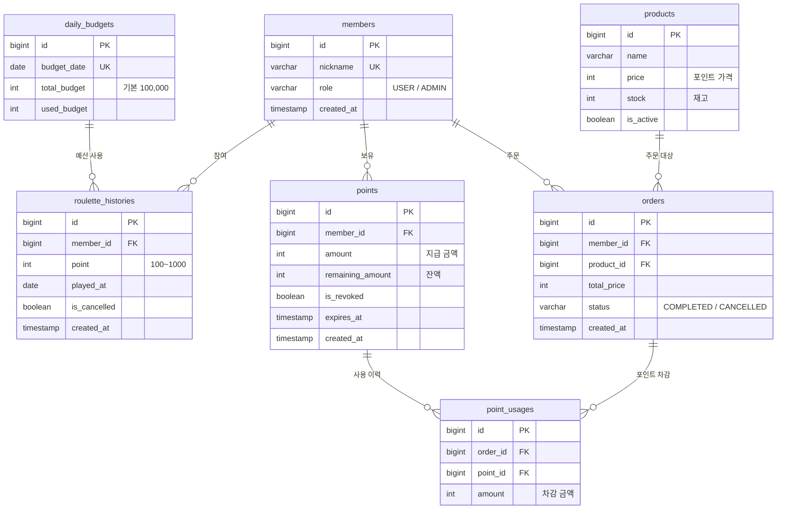

# 포인트 룰렛 서비스

사용자가 매일 룰렛을 돌려 랜덤 포인트를 획득하고, 적립된 포인트로 상품을 구매할 수 있는 풀스택 서비스입니다.
웹, 앱, swagger를 접속했을 때 render의 sleep에서 일어나는 시간(대략 10초) 정도가 필요합니다.

## 소개

### 주요 기능

- **일일 예산 관리**: 하루 총 지급 포인트 한도를 설정하고, 예산 범위 내에서만 포인트를 지급합니다
- **1일 1회 룰렛**: 사용자당 하루 한 번 룰렛에 참여하여 100~1,000P 랜덤 포인트를 획득합니다
- **포인트 유효기간**: 포인트에 30일 만료 기한이 적용되며, 만료 임박 포인트를 알림으로 안내합니다
- **상품 구매**: 적립된 포인트로 상품을 교환하며, FIFO(선입선출) 방식으로 포인트를 차감합니다
- **어드민 관리**: 예산 설정, 상품 CRUD, 주문/룰렛 취소 및 포인트 환불/회수 기능을 제공합니다

### 동시성 처리

- **중복 참여 방지**: 서비스 레벨 체크(1차) + DB UNIQUE 제약(2차) 이중 방어
- **예산 초과 방지**: `PESSIMISTIC_WRITE` 비관적 락으로 예산 조회→확인→차감을 원자적 처리
- **재고 관리**: 상품 구매 시 비관적 락으로 재고 동시 차감 방지

## 기술 스택

| 영역 | 기술 |
|------|------|
| **백엔드** | Spring Boot 3.4 + Kotlin 2.1, JPA, Spring Security, JWT |
| **사용자 웹** | React 18 + TypeScript + Vite, Tailwind CSS, TanStack Query, Zustand |
| **어드민 웹** | React 18 + TypeScript + Vite, Ant Design, TanStack Query, Zustand |
| **모바일 앱** | Flutter + InAppWebView (web-user WebView 래핑) |
| **DB** | PostgreSQL (Neon), H2 (개발), Flyway 마이그레이션 |
| **배포** | Vercel (웹), Render (백엔드 Docker), Neon (DB) |
| **CI/CD** | GitHub Actions (빌드 + 테스트 + ktlint) |
| **테스트** | JUnit 5 + MockK (백엔드), k6 (부하 테스트) |

## 아키텍처



## 시작하기

### Prerequisites

- **백엔드**: JDK 17+, Gradle
- **웹 (user / admin)**: Node.js 18+, npm
- **앱**: Flutter SDK 3.x, Android SDK

### 설치

```bash
git clone https://github.com/your-repo/point-roulette.git
cd point-roulette
```

### 실행

**백엔드** (H2 인메모리 DB로 즉시 실행):
```bash
cd apps/backend
./gradlew bootRun
# Swagger UI: http://localhost:8080/swagger-ui/index.html
# H2 Console: http://localhost:8080/h2-console
```

**사용자 웹**:
```bash
cd apps/web-user
npm install && npm run dev
# http://localhost:5173
```

**어드민 웹**:
```bash
cd apps/web-admin
npm install && npm run dev
# http://localhost:5174
```

**모바일 앱**:
```bash
cd apps/app
flutter pub get && flutter run
```

## 프로젝트 구조

```
point-roulette/
├── apps/
│   ├── backend/          # Spring Boot + Kotlin API 서버
│   │   ├── src/main/kotlin/com/example/roulette/
│   │   │   ├── auth/         # 인증 (JWT 로그인)
│   │   │   ├── budget/       # 일일 예산 관리
│   │   │   ├── roulette/     # 룰렛 참여/취소
│   │   │   ├── point/        # 포인트 지급/조회/회수
│   │   │   ├── product/      # 상품 CRUD
│   │   │   ├── order/        # 주문/취소/환불
│   │   │   └── common/       # 공통 (예외, 응답, 설정)
│   │   ├── src/main/resources/db/migration/   # Flyway SQL (V1~V9)
│   │   └── Dockerfile        # 멀티스테이지 빌드 (JDK→JRE)
│   │
│   ├── web-user/         # React 사용자 웹
│   │   └── src/features/     # 기능별 (roulette, point, product, order)
│   │
│   ├── web-admin/        # React 관리자 웹
│   │   └── src/features/     # 기능별 (dashboard, budget, product, order)
│   │
│   └── app/              # Flutter 모바일 앱 (WebView)
│
├── docs/                 # 설계 문서, 대화 기록
├── .github/workflows/    # CI/CD 파이프라인
└── CLAUDE.md             # 프로젝트 규칙 (문서, 코드, Git 컨벤션)
```

## 환경 변수

각 앱의 `.env.example` 파일을 참고하여 `.env` 파일을 생성합니다.

**백엔드** (`apps/backend/.env.example`):

| 변수 | 설명 | 예시 |
|------|------|------|
| `SPRING_PROFILES_ACTIVE` | 활성 프로필 | `prod` |
| `DATABASE_URL` | PostgreSQL 접속 URL | `jdbc:postgresql://host.neon.tech/roulette` |
| `DB_USERNAME` | DB 사용자명 | `roulette` |
| `DB_PASSWORD` | DB 비밀번호 | - |
| `JWT_SECRET` | JWT 서명 키 (256비트 이상) | - |
| `CORS_ALLOWED_ORIGINS` | CORS 허용 도메인 (쉼표 구분) | `https://user.vercel.app,https://admin.vercel.app` |

**웹** (`apps/web-user/.env.example`, `apps/web-admin/.env.example`):

| 변수 | 설명 | 예시 |
|------|------|------|
| `VITE_API_URL` | 백엔드 API URL | `http://localhost:8080` |

**앱** (`apps/app/.env.example`):

| 변수 | 설명 | 전달 방식 |
|------|------|-----------|
| `ENV` | 환경 (dev/prod) | `--dart-define=ENV=prod` |
| `WEB_URL` | WebView 대상 URL | `--dart-define=WEB_URL=https://...` |

## API 엔드포인트

전체 API 문서는 Swagger UI(`/swagger-ui/index.html`)에서 확인할 수 있습니다.

| 메서드 | 경로 | 설명 | 권한 |
|--------|------|------|------|
| POST | `/api/auth/login` | 로그인 (닉네임) | 공개 |
| GET | `/api/budget/today` | 오늘 예산 조회 | 인증 |
| PUT | `/api/admin/budget/today` | 예산 설정 | ADMIN |
| POST | `/api/roulette/spin` | 룰렛 돌리기 | 인증 |
| GET | `/api/roulette/status` | 참여 상태 확인 | 인증 |
| POST | `/api/admin/roulette/{id}/cancel` | 룰렛 취소 | ADMIN |
| GET | `/api/admin/roulette/histories` | 전체 룰렛 내역 | ADMIN |
| GET | `/api/points/balance` | 포인트 잔액 | 인증 |
| GET | `/api/points` | 포인트 목록 | 인증 |
| GET | `/api/points/expiring-soon` | 만료 예정 포인트 | 인증 |
| GET | `/api/products` | 상품 목록 | 공개 |
| GET | `/api/admin/products` | 전체 상품 목록 | ADMIN |
| POST | `/api/admin/products` | 상품 등록 | ADMIN |
| PATCH | `/api/admin/products/{id}` | 상품 수정 | ADMIN |
| DELETE | `/api/admin/products/{id}` | 상품 삭제 | ADMIN |
| POST | `/api/orders` | 상품 주문 | 인증 |
| GET | `/api/orders` | 주문 내역 | 인증 |
| GET | `/api/admin/orders` | 전체 주문 목록 | ADMIN |
| POST | `/api/admin/orders/{id}/cancel` | 주문 취소 | ADMIN |

## 스크립트 목록

**백엔드**:
```bash
./gradlew bootRun          # 개발 서버 실행 (H2)
./gradlew test             # 테스트 실행 (JUnit 5 + MockK)
./gradlew jacocoTestReport # 커버리지 리포트 생성
./gradlew ktlintCheck      # 코드 스타일 검사
./gradlew ktlintFormat     # 코드 스타일 자동 수정
./gradlew bootJar          # JAR 빌드
```

**웹 (user / admin)**:
```bash
npm run dev    # 개발 서버 실행
npm run build  # 프로덕션 빌드
npm run lint   # ESLint 검사
```

**앱**:
```bash
flutter run                                    # 개발 실행
flutter build apk --release --dart-define=ENV=prod  # APK 빌드
flutter test                                   # 테스트 실행
flutter analyze                                # 정적 분석
```

**부하 테스트**:
```bash
k6 run --env BASE_URL=http://localhost:8080 apps/backend/k6/budget-load-test.js
```

## 배포 현황

| 항목          | URL / 위치 |
|-------------|-----------|
| 사용자 웹       | `https://test-tau-rust-26.vercel.app` |
| 어드민 웹       | `https://test-r1oh.vercel.app` |
| 백엔드 Swagger | `https://point-roulette-api-uspf.onrender.com/swagger-ui/index.html` |
| APK         | `apps/app/build/app/outputs/flutter-apk/app-release.apk` |
| APK 링크      | `https://drive.google.com/file/d/1VGI4s21gCjhdDnemYYNlUmFawlcuYR8L/view?usp=sharing` |
| CI/CD       | `.github/workflows/backend-ci.yml` |

## ERD


